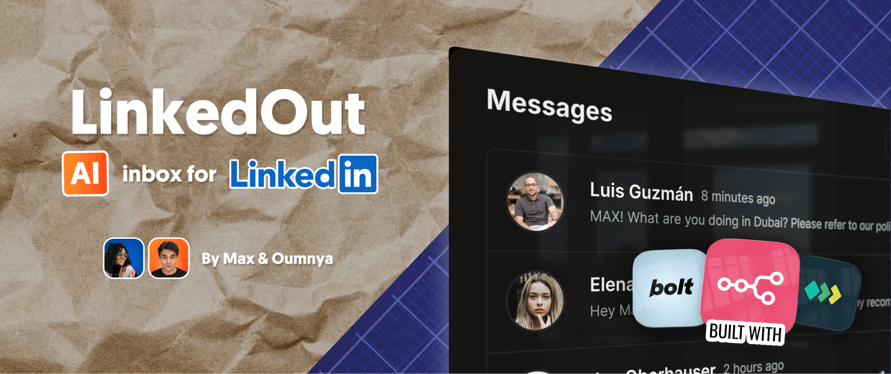
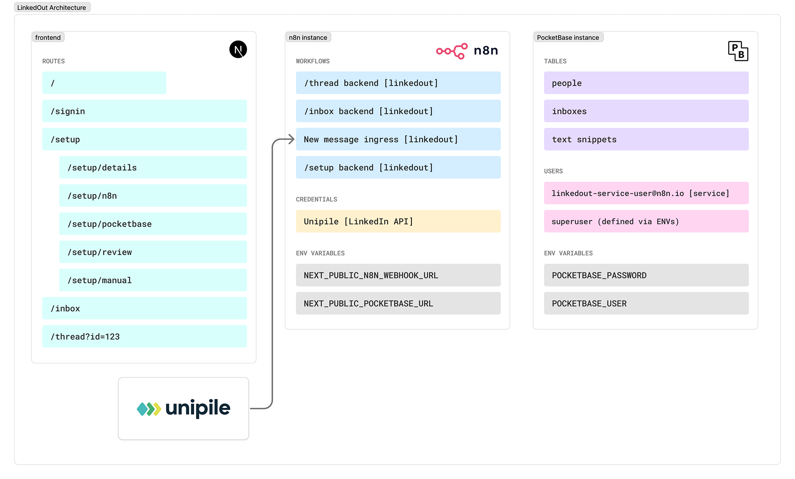

# LinkedOut - AI-Powered LinkedIn Inbox 

  

LinkedOut was built to help manage hectic LinkedIn inboxes on mobile and desktop. It includes AI draft replies and static text snippets library, making it a nimble assistant without being ChatGPT. Front-end built with Next.js, TypeScript, and Tailwind CSS. Backend runs on n8n and PocketBase. Clone it, tweak it, make it yours.

## Features

- AI-powered message drafts
- Responsive design for mobile and desktop
- Beautiful UI with dark mode support
- Secure authentication
- Setup wizard to deploy backend and set up database
- Open source: Self-host it, fork it.

## Known Outscope
- Logic breaks if you send the first message (no sendee data set in DB)
- Emoji reactions will not show
- Group threads do not show (only Classic LinkedIN inbox, no Sales navigator either). Should be easy to tweak.
- Draft reply only takes previous message (and name) as context. 
- Text Snippets can be Created/ Updated / Deleted via PocketBase, not yet in-app.
- Manual setup route not documented yet (working on it)
- Setup flow does not configure AI model nodes in n8n workflow (WIP)

## Tech Stack

  

### Frontend
- **Framework:** Next.js  (App Router)
- **Language:** TypeScript
- **Styling:** Tailwind CSS
- **UI Components:** shadcn/ui
- **Authentication:** Custom auth with JWT

### Backend
- **Database & Auth:** PocketBase
- **Workflows as Backend:** n8n via webhook endpoints, and n8n api for /setup
- **LinkedIn API Access:** Unipile

## Prerequisites

- Node.js 18+ 
- npm or yarn
- PocketBase instance
- n8n instance for automation workflows. Get 50% off [n8n cloud](https://app.n8n.cloud/register?utm_campaign=linkedout) for 12 months with MAX50. Enter coupon after free trial when choosing a plan.
- A [Unipile account for](https://www.unipile.com/linkedin-api-a-comprehensive-guide-to-integration/?utm_source=youtube&utm_campaign=MAXFROMN8N) LinkedIn API access. Get 50% off Unipile for 3 months with MAXFROMN8N code (message support with code after sign up)

## Installation
### Via CloudStation Template
1. Set up the one-click LinkedOut + PocketBase template on CloudStation: [CloudStation LinkedOut Template](https://app.cloud-station.io/template-store/linkedout). You'll need an n8n instance ready by this step.
2. Open LinkedOut front end from CloudStation dashboard and sign in with PocketBase superuser credentials (see them in PocketBase deployment env variables in CloudStation dashboard)
3. Complete the setup wizard (go to /setup if you get redirected to /inbox)
4. Open your n8n workflows and replace any AI model steps with your own (not yet part of setup flow). 

### Via Manual Deployment
WIP

## Troubleshooting
Nothing here yet

## Environment Variables

| Variable | Description | Required |
|----------|-------------|----------|
| `NEXT_PUBLIC_N8N_WEBHOOK_URL` | N8N URL (without /webhook) | Yes |
| `NEXT_PUBLIC_POCKETBASE_URL` | PocketBase URL | Yes |
Note: do not include '/' trailing slash in URL env variables. It will break things (WIP to filter that out).

---

  Made with ❤️ by <a href="https://github.com/maxtkacz">Max </a>and <a href="https://github.com/oumnya">Oumnya</a>  

